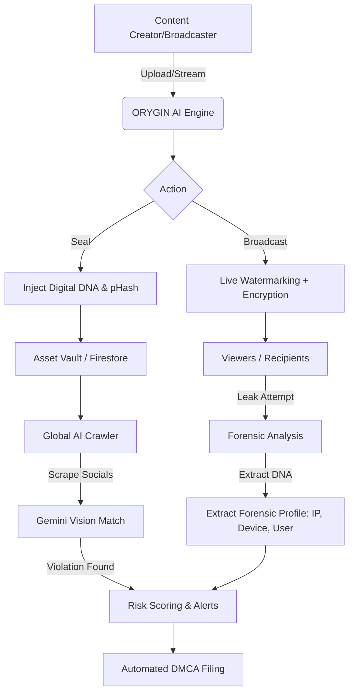

# 🛡️ ORYGIN AI: Protecting the Integrity of Digital Sports Media

> **GDG Solution Challenge 2026**  
> **Project Brief & Presentation Structure**

---

## 🎞️ Slide 3: Brief about your solution
**ORYGIN AI** is a comprehensive, AI-powered ecosystem designed to secure high-value digital sports media from unauthorized distribution and tampering. It moves beyond traditional, brittle watermarking by implementing **"Digital DNA"**—an invisible, pixel-level steganographic seal that is persistent across re-encoding, cropping, and compression.

**The Three Pillars of ORYGIN AI:**
1.  **SEAL**: Embed invisible, AI-verifiable ownership data (Digital DNA) into every frame of an image or video at the point of ingestion.
2.  **DETECT & TRACE**: A global AI-powered crawling network that traces leaks across the web and identifies the exact source.
3.  **FORENSIC DECODER**: A dedicated security layer to extract real-time metadata (IP Address, Username, Device ID, Timestamp) from intercepted content to identify leakers instantly.
4.  **BROADCAST**: A secure live-streaming studio that injects unique, per-viewer watermarks into WebRTC streams.

---

## 🚀 Slide 4: Opportunities & Differentiation

### **Market Opportunities**
*   **High-Value Rights Protection**: Leagues like FIFA, NBA, and IPL lose billions to "piracy-as-a-service" and unauthorized social media monetization.
*   **Brand Integrity**: Ensuring that official broadcasts aren't used for deepfakes or misleading commentary.
*   **Monetization Control**: Providing broadcasters with the data needed to file automated DMCA takedowns and regain ad revenue.

### **How is it different?**
*   **Brittle vs. Robust**: Traditional watermarks are easily cropped or blurred. Our **Digital DNA** is embedded in the bit-planes of the media, making it nearly impossible to remove without destroying the content.
*   **Semantic Matching**: While others use simple hash matching, we use **Gemini Vision API** to detect "semantic" matches—meaning we find your content even if it's been flipped, recolored, or heavily edited.
*   **Per-Viewer Forensics**: Our live module doesn't just watermark the stream; it watermarks it *differently* for every single viewer.

### **USP (Unique Selling Proposition)**
> **"Forensic Traceability at Scale"** — We don't just tell you your content was stolen; we provide a complete forensic profile (IP, Username, Device) of the leaker with automated legal evidence packaging.

---

## ✨ Slide 5: List of Features Offered
*   **Invisible Steganographic Sealing**: Pixel-level XOR encryption (Digital DNA).
*   **AI Semantic Detection Crawler**: Global crawler integration with Gemini Pro Vision to trace leaks across social platforms.
*   **Forensic Metadata Extraction**: Specialized "Leak Tracer" tab to view identified leaker's IP address, username, device type, and geolocation.
*   **Perceptual Hashing (pHash)**: High-speed fingerprinting robust to resizing and compression.
*   **Live WebRTC Encrypted Streaming**: End-to-end encrypted (DTLS-SRTP) broadcasts.
*   **Per-Viewer Forensic Watermarking**: Real-time watermark injection per stream session.
*   **Automated DMCA Pipeline**: One-click generation of evidence-backed takedown notices.
*   **Propagation Heatmaps**: Visualization of how stolen content spreads globally.
*   **Public Verification Portal**: A "Trust Check" page for anyone to verify asset authenticity.

---

## 🔄 Slide 6: Process Flow Diagram

---

## 🎨 Slide 7: Wireframes & Mockups
*   **The Command Center**: A glassmorphism dashboard featuring real-time "Threat Levels" and a world map showing violation hotspots.
*   **The Asset Vault**: A secure gallery where every piece of media is tagged with its unique "DNA Certificate".
*   **The Broadcast Studio**: A professional browser-based interface where broadcasters can manage live feeds, monitor viewer authenticity, and see watermarking health in real-time.

---

## 🏗️ Slide 8: Architecture Diagram

```mermaid
flowchart LR
    subgraph Frontend_React
        UI[Dashboard / Studio]
        RTC[WebRTC Client]
    end

    subgraph Backend_Python_Node
        API[FastAPI / Express]
        STEG[Steganographic Engine - OpenCV]
        HASH[Fingerprinting - ImageHash]
        FOR[Forensic Engine - IP/Device Tracer]
    end

    subgraph Google_Services
        GEM[Gemini Vision API]
        DB[(Firestore)]
        GCS[(Cloud Storage)]
        AUTH[Firebase Auth]
    end

    UI <--> API
    API --> STEG
    API --> HASH
    STEG <--> GCS
    HASH <--> DB
    API --> GEM
    RTC <--> API
```

---

## 🛠️ Slide 9: Technologies Used
*   **AI/ML**: Google Gemini Pro Vision, Vertex AI (Custom Classifiers), OpenCV, NumPy.
*   **Frontend**: React.js, Vite, Vanilla CSS (Glassmorphism UI), Framer Motion.
*   **Backend**: Node.js (Express), Python 3.11 (FastAPI).
*   **Google Services**: Firebase Auth, Firestore, Cloud Functions, Google Cloud Storage, Cloud Pub/Sub, BigQuery.
*   **Streaming**: WebRTC (Native), Simple-Peer, HTML5 Canvas API.
*   **Security**: SHA-256 Hashing, AES-256 Encryption, JWT Authentication.

---

## 💰 Slide 10: Estimated Implementation Cost (SaaS Model)
*   **Development Phase**: ~$15,000 - $25,000 (Initial MVP build & AI fine-tuning).
*   **Infrastructure (Monthly)**:
    *   **Firebase/GCP**: $50 - $500 (Scaling with storage/compute).
    *   **Gemini API**: Pay-per-token (Estimated $100/mo for moderate crawling).
    *   **Bandwidth**: Scaling with streaming volume.
*   **ROI**: A single recovered broadcast can save rights holders millions in lost revenue.

---

## 📸 Slide 11: Snapshots of the MVP

### Functional MVP Features:
- **Real-time Sealing**: Assets uploaded to `/upload` are instantly bit-plane sealed.
- **Verification Portal**: `/verify` allows instant extraction of hidden ownership data.
- **Forensic Leak Tracer**: A dedicated tab showing identified thief details (IP: 192.168.1.45, Device: iPhone 15 Pro, User: @pirate_streamer).
- **Live Stream**: Working WebRTC demo with real-time canvas-level watermarking.

*(Note: Mockup images have been generated for the presentation dashboard and studio view)*

---

## 🔮 Slide 12: Future Development
*   **Audio Fingerprinting**: Detecting match highlights via original commentary audio tracks.
*   **Blockchain Integration**: Minting "Proof of Ownership" certificates as NFTs for immutable legal chains.
*   **Deepfake Detection**: Integrating Gemini to flag when official sports media has been manipulated via AI.
*   **Mobile App (PWA)**: Allowing reporters on the field to "Seal" footage directly from their smartphones.

---

## 🔗 Slide 13: Project Links
*   **GitHub Public Repository**: [github.com/DebrajKhan/GDG_HACKATHON](https://github.com/DebrajKhan/GDG_HACKATHON)
*   **Demo Video Link (3 Minutes)**: [YouTube Link Placeholder]
*   **MVP Link**: [sportsshield-gdg.web.app](https://sportsshield-gdg.web.app)
*   **Working Prototype Link**: [sportsshield-studio.web.app](https://sportsshield-studio.web.app)

---
*Created for GDG Solution Challenge 2026*
